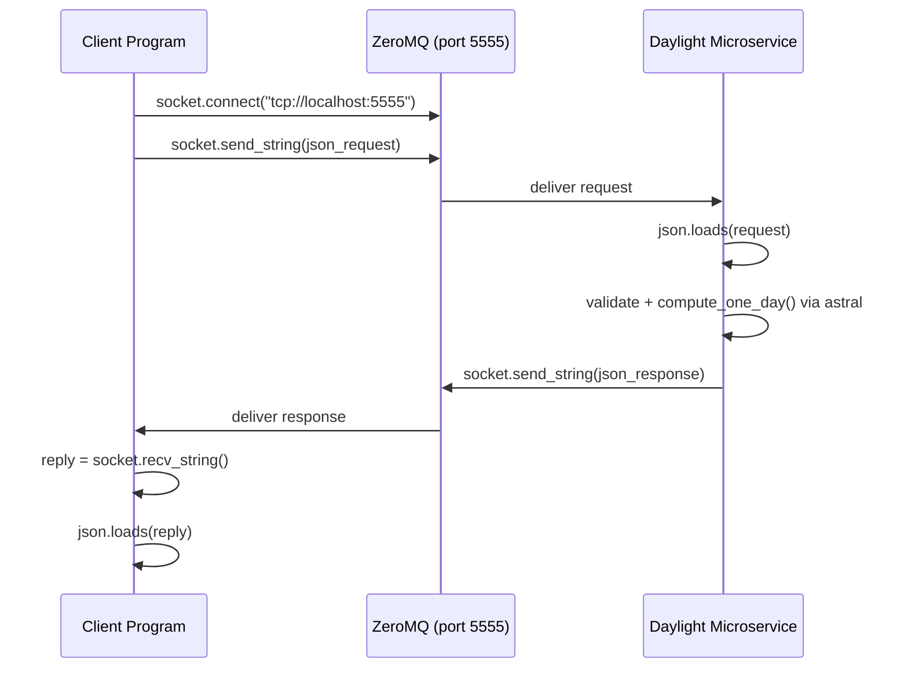

# Daylight Microservice

## How to request data

Connect a ZeroMQ REQ socket to `tcp://localhost:5555` and send a JSON string with these fields:

- `action` — `"get_day"` or `"get_range"`
- `latitude` — number, −90 to 90
- `longitude` — number, −180 to 180
- `date` — string, `YYYY-MM-DD` (start date for range)
- `num_days` — integer, only for `get_range`

**Example:**

```python
import zmq, json

socket = zmq.Context().socket(zmq.REQ)
socket.connect("tcp://localhost:5555")

request = {
    "action": "get_day",
    "latitude": 45.3236,
    "longitude": -121.7300,
    "date": "2026-06-21"
}
socket.send_string(json.dumps(request))
```

## How to receive data

After sending, read the reply from the same socket. The reply is a JSON string.

**Example:**

```python
reply = socket.recv_string()
data = json.loads(reply)
print(data)
```

**Success response (`get_day`):**

```json
{
  "latitude": 45.3236,
  "longitude": -121.73,
  "date": "2026-06-21",
  "sunrise": "05:23",
  "sunset": "21:01",
  "total_daylight_minutes": 938
}
```

**Success response (`get_range`):** same shape, with a `days` array.

**Error response (any invalid input):**

```json
{ "error": "latitude must be a number" }
```

## UML sequence diagram


